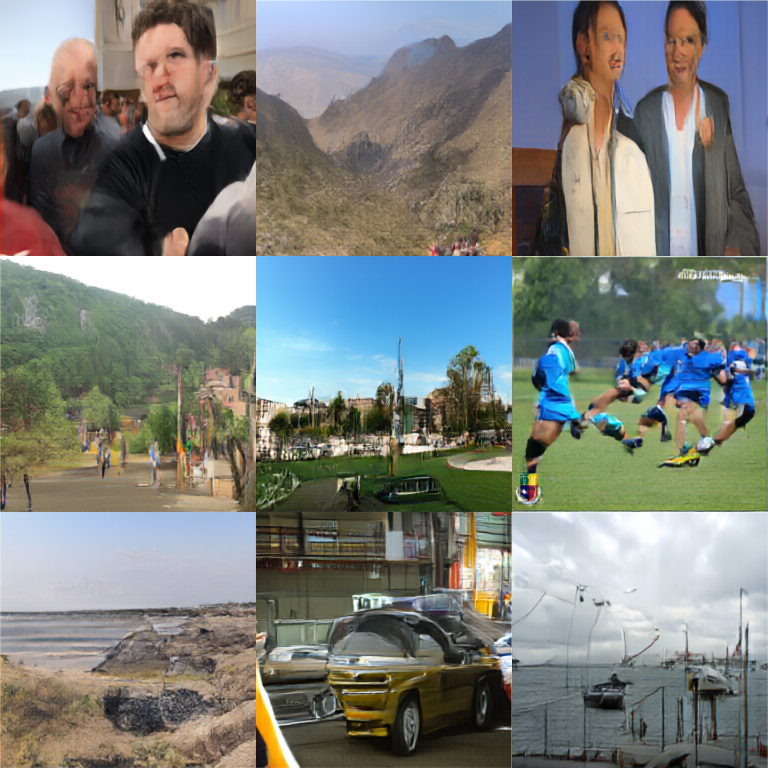

# Flow Matching and Image Generation

A repo holding the code for my implementation of a DiT with REPA-E.

Check out the [blogpost](https://bhoener.github.io/posts/Flow-Matching-and-Image-Generation/)!



## Use

First clone and `cd` into the repository:

```bash
git clone https://github.com/bhoener/diffusion-transformer
cd diffusion-transformer
```

Then, activate the virtual environment:

```bash
source env/bin/activate
```

Install dependencies:

```bash
uv pip install -r requirements.txt
```

All code is under `src/`.

To start a training run with ddp:

```
cd src
torchrun --standalone --nproc_per_node=8 train.py
```

Replace `8` with your number of GPUs.
